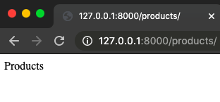

# Manual-Django
Django es un framework de desarrollo web de código abierto, escrito en Python.

## Instalación 
Necesitamos tener instalado Python y Pip para poder seguir con este proceso.

Nos ubicamos dónde queremos crear el entorno virtual en el Terminal:
Para instalar el entorno virtual de Python:
`$ pip install virtualenv`

Para crear un entorno virtual:
`$ virtualenv 'nombre'`

Para activar el entorno virtual:
`$ source 'nombre'/bin/activate`

Instalamos Django en el entorno virtual:
`$ python -m pip install Django`

Luego creamos un Proyecto Django:
`$ django-admin startproject 'nombre'`

Nota: Es importante recordar que si encontramos el problema de "unresolved import" lo resolveremos de esta manera:
(Shift + cmd + p) para abri el Comand Palette de VSC y ahí seleccionamos Python. En el source code copiamos esto con la dirección en donde se encuentre nuestro proyecto (con un pwd en el Terminal se podrá saber):

`”python.pythonPath”: “/path/to/your/venv/bin/python”,`

## Estructura Inicial
Se creara una carpeta que tendrá otra carpeta con él mismo nombre y un archivo “manage.py” que no debemos tocar, lo dejaremos solo. Este archivo se utiliza para initializer el proyecto.

En la carpeta habrá 4 documentos:

- _init_.py (Necesario para que Python reconozca que existe un paquete)
- settings.py (Archivo principal del proyecto, el centro de configuración)
- urls.py (Sistema de Routing de Urls que contiene un lista de ‘paths’)
- wsgi.py (Web server que nos crea Django)

Adentro de “settings.py” cuando queremos que Django sepa de una nueva instalación lo especificamos en “INSTALLED_APPS”. 

## Inicializar el Server del Proyecto
Para iniciar un server utilizamos:
`python manage.py runserver`

Una vez iniciado el server podremos copiar la dirección ip local en nuestro navegador de preferencia y obtendremos una pantalla cómo esta:


Para desactivar el server podemos cerrar la pestaña del terminal o pulsar Ctrl + C.

## Apps
Los proyectos de Django forman parte de ‘Apps’ que se podrían ver como diferentes elementos de la página web.

Para crear una app usamos el comando:
`$ python manage.py startapp 'nombre'`
Al crear una app esta también vendrá con diferentes carpetas, las principales donde trabajaremos son:

- admin.py (Admin panel of the website)
- models.py (Donde creamos nuestra bases de datos)
-views.py (Donde se ubican las clases que activan los templates del proyecto)

Después de crear un app la agregamos a “INSTALLED_APPS” en settings.py. La introduciremos con entre comillas el nombre de la App y poseriormente con una coma.


URLs & Paths


Como mencionamos anteriormente, en nuestra app creada anteriormente en “views.py” agregaremos las siguientes secciones:
	1. La primera es los imports, que uno ya viene incluido y el HttpResponse hay que agregarlo nosotros de manera manual.
	2. La funciones de cada sección que consisten con una request y devuelven una respuesta Http con un string.

Así se vería views.py de nuestra app:
```python
# Esto viene incluido
from django.shortcuts import render

# Esto lo agregamos 
from django.http import HttpResponse

def home(request):
    return HttpResponse("Home Page")

def products(request):
    return HttpResponse("Products")  

def customer(request):
    return HttpResponse("Customer")     
```
	

Ahora para la app queremos crear un nuevo archivo llamado “urls.py”, en el cual agregaremos el import path, el import views y el Urlpatterns que es donde marcaremos la dirección url de cada path y la función de views respectiva. (El caso de Home no se pone nada en el path ya que es path por defecto).

```python
from django.urls import path
from . import views

urlpatterns = [
    path('', views.home),
    path('products/', views.products),
    path('customer/', views.customer),
]
```

Ahora en el “urls.py” principal deberemos agregar en el import al lado de path con una coma “include”. Luego crearemos un nuevo path debajo de admin el cual nos enviara al urls.py de nuestra app, en esta caso la app se llama “accounts”.

```python
from django.contrib import admin
from django.urls import path, include

urlpatterns = [
    path('admin/', admin.site.urls),
    path('', include('accounts.urls')),
]
```

El urls.py principal nos enviará al urls.py de nuestra app y este activara las funciones en el views.py. Ahora si corremos nuestro server tendrá que aparecer el string que introducimos anteriormente.



