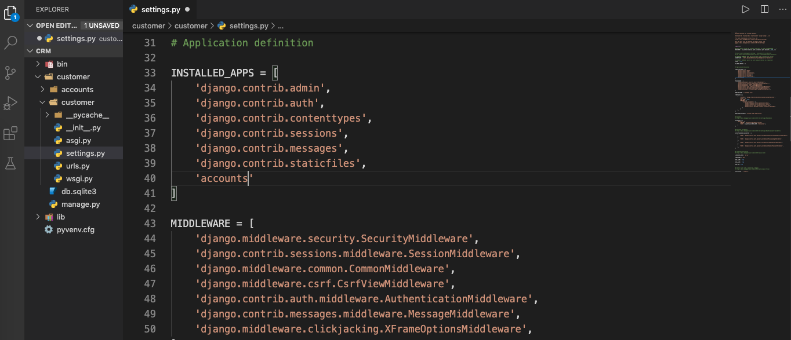

# Manual-Django
Django es un framework de desarrollo web de código abierto, escrito en Python.


## Instalación 
Necesitamos tener instalado Python y Pip para poder seguir con este proceso.

Nos ubicamos dónde queremos crear el entorno virtual en el Terminal:
Para instalar el entorno virtual de Python:
`$ pip install virtualenv`

Para crear un entorno virtual:
`$ virtualenv 'nombre'`

Para activar el entorno virtual:
`$ source 'nombre'/bin/activate`

Instalamos Django en el entorno virtual:
`$ python -m pip install Django`

Luego creamos un Proyecto Django:
`$ django-admin startproject 'nombre'`

Nota: Es importante recordar que si encontramos el problema de "unresolved import" lo resolveremos de esta manera:
(Shift + cmd + p) para abri el Comand Palette de VSC y ahí seleccionamos Python. En el source code copiamos esto con la dirección en donde se encuentre nuestro proyecto (con un pwd en el Terminal se podrá saber):

`”python.pythonPath”: “/path/to/your/venv/bin/python”,`

## Estructura Inicial
Se creara una carpeta que tendrá otra carpeta con él mismo nombre y un archivo “manage.py” que no debemos tocar, lo dejaremos solo. Este archivo se utiliza para initializer el proyecto.

En la carpeta habrá 4 documentos:

- _init_.py (Necesario para que Python reconozca que existe un paquete)
- settings.py (Archivo principal del proyecto, el centro de configuración)
- urls.py (Sistema de Routing de Urls que contiene un lista de ‘paths’)
- wsgi.py (Web server que nos crea Django)

Adentro de “settings.py” cuando queremos que Django sepa de una nueva instalación lo especificamos en “INSTALLED_APPS”. 

## Inicializar el Server del Proyecto
Para iniciar un server utilizamos:
`python manage.py runserver`

Una vez iniciado el server podremos copiar la dirección ip local en nuestro navegador de preferencia y obtendremos una pantalla cómo esta:


Para desactivar el server podemos cerrar la pestaña del terminal o pulsar Ctrl + C.

## Apps
Los proyectos de Django forman parte de ‘Apps’ que se podrían ver como diferentes elementos de la página web.

Para crear una app usamos el comando:
`$ python manage.py startapp 'nombre'`
Al crear una app esta también vendrá con diferentes carpetas, las principales donde trabajaremos son:

- admin.py (Admin panel of the website)
- models.py (Donde creamos nuestra bases de datos)
-views.py (Donde se ubican las clases que activan los templates del proyecto)

Después de crear un app la agregamos a “INSTALLED_APPS” en settings.py. La introduciremos con entre comillas el nombre de la App y poseriormente con una coma.



## URLs & Paths


Como mencionamos anteriormente, en nuestra app creada anteriormente en “views.py” agregaremos las siguientes secciones:

- La primera es los imports, que uno ya viene incluido y el HttpResponse hay que agregarlo nosotros de manera manual.
- La funciones de cada sección que consisten con una request y devuelven una respuesta Http con un string.

Así se vería views.py de nuestra app:
```python
# Esto viene incluido
from django.shortcuts import render

# Esto lo agregamos 
from django.http import HttpResponse

def home(request):
    return HttpResponse("Home Page")

def products(request):
    return HttpResponse("Products")  

def customer(request):
    return HttpResponse("Customer")     
```
	

Ahora para la app queremos crear un nuevo archivo llamado “urls.py”, en el cual agregaremos el import path, el import views y el Urlpatterns que es donde marcaremos la dirección url de cada path y la función de views respectiva. (El caso de Home no se pone nada en el path ya que es path por defecto).

```python
from django.urls import path
from . import views

urlpatterns = [
    path('', views.home),
    path('products/', views.products),
    path('customer/', views.customer),
]
```

Ahora en el “urls.py” principal deberemos agregar en el import al lado de path con una coma “include”. Luego crearemos un nuevo path debajo de admin el cual nos enviara al urls.py de nuestra app, en esta caso la app se llama “accounts”.

```python
from django.contrib import admin
from django.urls import path, include

urlpatterns = [
    path('admin/', admin.site.urls),
    path('', include('accounts.urls')),
]
```

El urls.py principal nos enviará al urls.py de nuestra app y este activara las funciones en el views.py. Ahora si corremos nuestro server tendrá que aparecer el string que introducimos anteriormente.


Herencia y Templates
Para empezar con los templates tenemos que crear una carpeta en nuestra app llamada ‘templates’ (es necesario usar este nombre), dentro de esta carpeta creamos otra carpeta llamada como nuestra app. En esta carpeta es donde almacenaremos nuestros templates. Aquí ya podremos crear nuestros archivos html. 

Ahora crearemos un html básico con el nombre “dashboard.html”.
```html
<!DOCTYPE html>
<html>
<head>
<title>CRM</title>
</head>
<body>
    <h1>Dashboard</h1>
</body>
</html>
```

Después de crear este archivo nos dirigiremos a views.py de nuestra aplicación y mediante el render que fue importado por Django al crear el proyecto, podremos “conectar” la función con el template.

```python
# Esto viene incluido 
from django.shortcuts import render

# Esto lo agregamos 
from django.http import HttpResponse

def home(request):
    return render(request, 'accounts/dashboard.html')
```

Si ahora nos dirigimos otra vez al navegador podremos ver que se ha actualizado y ahora vemos el contenido del archivo html.


Ahora haremos lo mismo con las funciones de products y customer. Asignándole un html propio a cada una.

```python
# Esto viene incluido
from django.shortcuts import render

# Esto lo agregamos 
from django.http import HttpResponse

def home(request):
    return render(request, 'accounts/dashboard.html')

def products(request):
    return render(request, 'accounts/products.html')  

def customer(request):
    return render(request, 'accounts/customer.html')
```

Este para pequeños proyectos es redundante ya que si necesitamos actualizar un navbar tendríamos que cambiarlo en cada html, por lo tanto se crea un html base para heredar los componentes a los demás html.

Para lograr esto crearemos un archivo llamado “main.html” en la carpeta templates/accounts.  Aquí introduciremos los elementos que serán compartidos por cada uno (Ej: nav, footer, etc) y dentro de este archivo dejaremos un apartado usando (“”) que es el método de introducir código Python en html y dejaremos asignados un bloque donde se podrá introducir contenido en cada template.

El main.html se vería de esta manera:
```html
<!DOCTYPE html>
<html>
<head>
<title>CRM</title>
</head>
<body>
    <h1>Aquí irá el NavBar</h1>
    <hr>

    
    <!-- Aquí es donde corresponde cada template -->
    

    <hr>
    <h5>Aquí irá el footer</h5>
</body>
</html> 
```

Ahora en cada “Child Element” hay que asignar como heredar del “main.html”, esto se logra extendiendo usando los template tags y luego escribiremos dónde empieza el bloque y dónde acaba este, para escribir el contenido respectivo de ese template.

```html




<h2> Dashboard </h2>


```


Cuando nuestro código empieza a tener un tamaño considerable es recomendable dividir cada sección  en diferentes archivos html (Ej: uno para el navbar y otro para el footer). Luego solo necesitamos incluirlo donde dejamos por ejemplo en el main.html.

```html
<!DOCTYPE html>
<html>
<head>
<title>CRM</title>
</head>
<body>
    

    
    <!-- Aquí es donde introduciremos el contenido en cada template -->
    

    
</body>
</html> 
```


## Archivo Estáticos e Imágenes

Los archivos estáticos es donde almacenaremos los estilos (css), nuestro JavaScript e imágenes de nuestro proyecto para no tener que ponerlo en el html ya que estas son prácticas no recomendadas. Para esto tenemos que crear una carpeta llamada “static” en carpeta principal del proyecto y dentro de esta creamos las carpetas de “css”, “js” e “images”.

Ahora crearemos en la carpeta “css” el archivo “main.css” donde se guardarán los estilos de nuestro proyecto. 

Después de crear nuestro archivo necesitamos “notificar” a Django sobre la existencia de este, esto se logra yendo a “settings.py”. Donde nos iremos hasta abajo del archivo donde dice “STATIC_URL”  y justo abajo escribiremos:
```python
# Esto viene por defecto:
STATIC_URL = '/static/'
# Escribimos lo siguiente:
MEDIA_URLS ='/images/'

STATICFILES_DIRS = [
    os.path.join(BASE_DIR, 'static')
]

```


Ahora necesitamos ir a nuestro “main.html” para poder conectar el archivo html con el css.  Primero tenemos que agregar al principio del archivo el load static y luego agregar el link tag usando el método de Django, se vería de la forma siguiente:

```html
<!-- Agregamos el load static al archivo -->


<!DOCTYPE html>
<html>
<head>
<title>CRM</title>
<!-- Link tag usando el método Django -->
<link rel="stylesheet" type="text/css" href="">
</head>
```


Ahora agregaremos al navbar una imagen que nos servirá como logo, utilizando un método similar al anterior:

```html
<!-- Agregamos el load static al archivo -->


<nav class="navbar navbar-expand-md navbar-dark bg-dark">
    
```


 Bases de Datos y Panel de Administrador
La configuración estándar de bases de datos de Django es ‘SQLite’ pero se pueden configurar otras bases de datos de nuestra preferencia, como ‘MySQL’ y ‘PostgreSQL’.  

Para migrar la información de la página web a la base de datos usamos los comandos:
`$ python manage.py migrate`
Esto cojera nuestra ‘setup’ y creara las tablas por nosotros. 

Ahora para ver nuestros datos primero tenemos que crear un usuario con una contraseña, esto se hace usando el comando:
`$ python manage.py createsuperuser`

Una vez creada la cuenta nos podemos meter en ella siguiente la siguiente ruta en el navegador: 
`http://127.0.0.1:8000/admin`


Desde este panel podremos modificar nuestros datos, agregar e eliminar elementos.

Ahora pasaremos a los ‘models’ estos se ubican en nuestra app en el archivo “models.py” y estos son simplemente clase Python que se heredan de Django models y nos permiten crear clases  que representan tablas de bases de datos.


Ahora crearemos una clase para ‘Customer’:
```python
from django.db import models

# Create your models here.

class Customer(models.Model):
    # Ponemos null=True para que no nos de error si esta vacío el campo.
    name = models.CharField(max_length=200, null=True)
    phone = models.CharField(max_length=200, null=True)
    email = models.EmailField(max_length=200, null=True)
    date_created = models.DateTimeField(auto_now_add=True, null=True)
```

Ahora pasamos nuestra ‘setup’ a nuestra bases de datos usando los siguientes comandos:

El primero es para crear las tablas (la vez pasado no lo hicimos ya que estas ya fueron hechas por Django):

`$ python manage.py makemigrations`

La segunda es la usamos anteriormente para hacer la migración:

`$ python manage.py migrate`

Ahora necesitamos registras esa tabla en nuestro panel de administrador, esto se consigue yendo a ‘admin.py’ de nuestra app, donde agregaremos models de Customer y lo registraremos:
```python
from django.contrib import admin

# Register your models here.

from .models import Customer

admin.site.register(Customer)
```

Ahora nos aparecerá en nuestro panel de admin:


Aquí podremos agregar un nuevo Customer de manera manual.


Ahora para que en el objeto del customer aparezca el nombre de nuestro clientes agregamos a ‘models.py’ la función siguiente:
```python
from django.db import models

# Create your models here.

class Customer(models.Model):
    # Ponemos null=True para que no nos de error si esta vacío el campo.
    name = models.CharField(max_length=200, null=True)
    phone = models.CharField(max_length=200, null=True)
    email = models.EmailField(max_length=200, null=True)
    date_created = models.DateTimeField(auto_now_add=True, null=True)

    #Agregamos esta función para ver el nombre
    def __str__(self):
        return self.name
```

