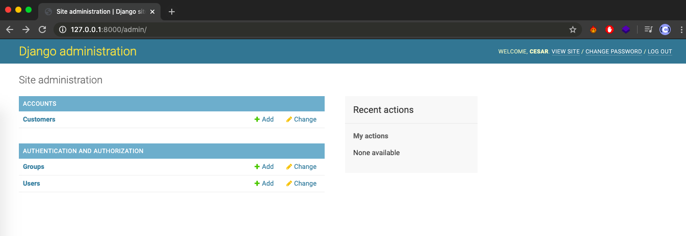
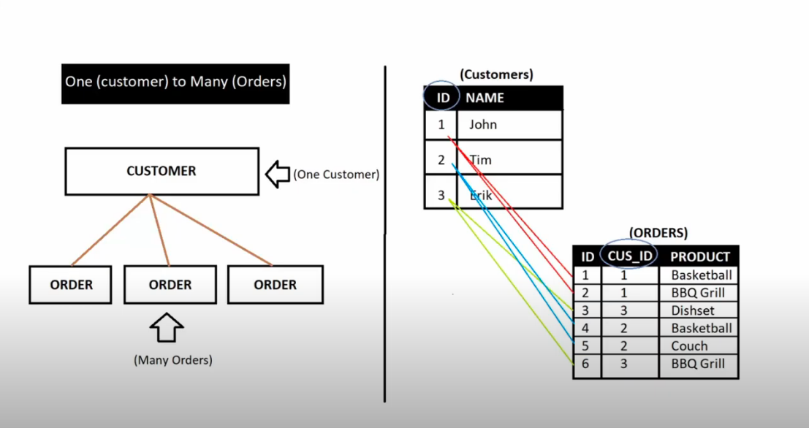
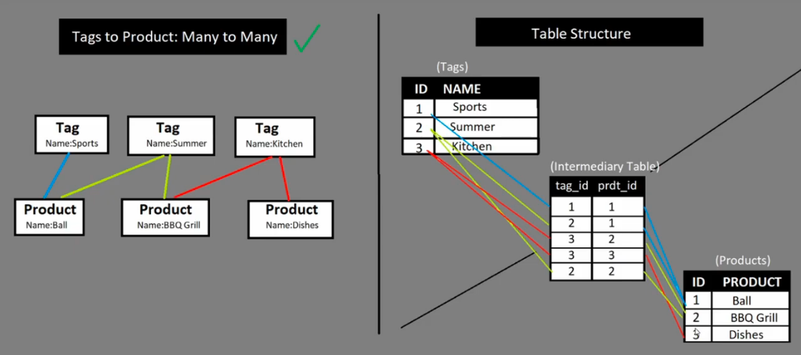

# Manual-Django


Django es un framework de desarrollo web de código abierto, escrito en Python.

## Instalación 
Necesitamos tener instalado Python y Pip para poder seguir con este proceso.

Nos ubicamos dónde queremos crear el entorno virtual en el Terminal:
Para instalar el entorno virtual de Python:

`$ pip install virtualenv`

Para crear un entorno virtual:

`$ virtualenv 'nombre'`

Para activar el entorno virtual:

`$ source 'nombre'/bin/activate`

Instalamos Django en el entorno virtual:

`$ python -m pip install Django`

Luego creamos un Proyecto Django:

`$ django-admin startproject 'nombre'`

Nota: Es importante recordar que si encontramos el problema de "unresolved import" lo resolveremos de esta manera:
(Shift + cmd + p) para abrir el Comand Palette de VSC y ahí seleccionamos Python. En el source code copiamos esto con la dirección en donde se encuentre nuestro proyecto (con un pwd en el Terminal se podrá saber):

`”python.pythonPath”: “/path/to/your/venv/bin/python”,`

## Estructura Inicial
Se creara una carpeta que tendrá otra carpeta con él mismo nombre y un archivo “manage.py” que no debemos tocar, lo dejaremos solo. Este archivo se utiliza para inicializar el proyecto.

En la carpeta habrá 4 documentos:

- _init_.py (Necesario para que Python reconozca que existe un paquete)
- settings.py (Archivo principal del proyecto, el centro de configuración)
- urls.py (Sistema de Routing de Urls que contiene un lista de ‘paths’)
- wsgi.py (Web server que nos crea Django)

Adentro de “settings.py” cuando queremos que Django sepa de una nueva instalación lo especificamos en “INSTALLED_APPS”. 

## Inicializar el Server del Proyecto
Para iniciar un server utilizamos:
`python manage.py runserver`

Una vez iniciado el server podremos copiar la dirección ip local en nuestro navegador de preferencia y obtendremos una pantalla cómo esta:


Para desactivar el server podemos cerrar la pestaña del terminal o pulsar Ctrl + C.

## Apps
Los proyectos de Django forman parte de ‘Apps’ que se podrían ver como diferentes elementos de la página web.

Para crear una app usamos el comando:
`$ python manage.py startapp 'nombre'`

Al crear una app esta también vendrá con diferentes carpetas, las principales donde trabajaremos son:

- admin.py (Admin panel of the website)
- models.py (Donde creamos nuestra bases de datos)
-views.py (Donde se ubican las clases que activan los templates del proyecto)

Después de crear un app la agregamos a “INSTALLED_APPS” en settings.py. La introduciremos con entre comillas el nombre de la App y poseriormente con una coma.


## URLs & Paths


Como mencionamos anteriormente, en nuestra app creada anteriormente en “views.py” agregaremos las siguientes secciones:

- La primera es los imports, que uno ya viene incluido y el HttpResponse hay que agregarlo nosotros de manera manual.
- La funciones de cada sección que consisten con una request y devuelven una respuesta Http con un string.

Así se vería views.py de nuestra app:
```python
# Esto viene incluido
from django.shortcuts import render

# Esto lo agregamos 
from django.http import HttpResponse

def home(request):
    return HttpResponse("Home Page")

def products(request):
    return HttpResponse("Products")  

def customer(request):
    return HttpResponse("Customer")     
```
	

Ahora para la app queremos crear un nuevo archivo llamado “urls.py”, en el cual agregaremos el import path, el import views y el Urlpatterns que es donde marcaremos la dirección url de cada path y la función de views respectiva. (El caso de Home no se pone nada en el path ya que es path por defecto).

```python
from django.urls import path
from . import views

urlpatterns = [
    path('', views.home),
    path('products/', views.products),
    path('customer/', views.customer),
]
```

Ahora en el “urls.py” principal deberemos agregar en el import al lado de path con una coma “include”. Luego crearemos un nuevo path debajo de admin el cual nos enviara al urls.py de nuestra app, en esta caso la app se llama “accounts”.

```python
from django.contrib import admin
from django.urls import path, include

urlpatterns = [
    path('admin/', admin.site.urls),
    path('', include('accounts.urls')),
]
```

El urls.py principal nos enviará al urls.py de nuestra app y este activara las funciones en el views.py. Ahora si corremos nuestro server tendrá que aparecer el string que introducimos anteriormente.


## Herencia y Templates
Para empezar con los templates tenemos que crear una carpeta en nuestra app llamada ‘templates’ (es necesario usar este nombre), dentro de esta carpeta creamos otra carpeta llamada como nuestra app. En esta carpeta es donde almacenaremos nuestros templates. Aquí ya podremos crear nuestros archivos html. 

Ahora crearemos un html básico con el nombre “dashboard.html”.
```html
<!DOCTYPE html>
<html>
<head>
<title>CRM</title>
</head>
<body>
    <h1>Dashboard</h1>
</body>
</html>
```

Después de crear este archivo nos dirigiremos a views.py de nuestra aplicación y mediante el render que fue importado por Django al crear el proyecto, podremos “conectar” la función con el template.

```python
# Esto viene incluido 
from django.shortcuts import render

# Esto lo agregamos 
from django.http import HttpResponse

def home(request):
    return render(request, 'accounts/dashboard.html')
```

Si ahora nos dirigimos otra vez al navegador podremos ver que se ha actualizado y ahora vemos el contenido del archivo html.


Ahora haremos lo mismo con las funciones de products y customer. Asignándole un html propio a cada una.

```python
# Esto viene incluido
from django.shortcuts import render

# Esto lo agregamos 
from django.http import HttpResponse

def home(request):
    return render(request, 'accounts/dashboard.html')

def products(request):
    return render(request, 'accounts/products.html')  

def customer(request):
    return render(request, 'accounts/customer.html')
```

Este para pequeños proyectos es redundante ya que si necesitamos actualizar un navbar tendríamos que cambiarlo en cada html, por lo tanto se crea un html base para heredar los componentes a los demás html.

Para lograr esto crearemos un archivo llamado “main.html” en la carpeta templates/accounts.  Aquí introduciremos los elementos que serán compartidos por cada uno (Ej: nav, footer, etc) y dentro de este archivo dejaremos un apartado usando (“”) que es el método de introducir código Python en html y dejaremos asignados un bloque donde se podrá introducir contenido en cada template.

El main.html se vería de esta manera:
```html
<!DOCTYPE html>
<html>
<head>
<title>CRM</title>
</head>
<body>
    <h1>Aquí irá el NavBar</h1>
    <hr>

    
    <!-- Aquí es donde corresponde cada template -->
    

    <hr>
    <h5>Aquí irá el footer</h5>
</body>
</html> 
```

Ahora en cada “Child Element” hay que asignar como heredar del “main.html”, esto se logra extendiendo usando los template tags y luego escribiremos dónde empieza el bloque y dónde acaba este, para escribir el contenido respectivo de ese template.

```html




<h2> Dashboard </h2>


```


Cuando nuestro código empieza a tener un tamaño considerable es recomendable dividir cada sección  en diferentes archivos html (Ej: uno para el navbar y otro para el footer). Luego solo necesitamos incluirlo donde dejamos por ejemplo en el main.html.

```html
<!DOCTYPE html>
<html>
<head>
<title>CRM</title>
</head>
<body>
    

    
    <!-- Aquí es donde introduciremos el contenido en cada template -->
    

    
</body>
</html> 
```


## Archivo Estáticos e Imágenes

Los archivos estáticos es donde almacenaremos los estilos (css), nuestro JavaScript e imágenes de nuestro proyecto para no tener que ponerlo en el html ya que estas son prácticas no recomendadas. Para esto tenemos que crear una carpeta llamada “static” en carpeta principal del proyecto y dentro de esta creamos las carpetas de “css”, “js” e “images”.

Ahora crearemos en la carpeta “css” el archivo “main.css” donde se guardarán los estilos de nuestro proyecto. 

Después de crear nuestro archivo necesitamos “notificar” a Django sobre la existencia de este, esto se logra yendo a “settings.py”. Donde nos iremos hasta abajo del archivo donde dice “STATIC_URL”  y justo abajo escribiremos:
```python
# Esto viene por defecto:
STATIC_URL = '/static/'
# Escribimos lo siguiente:
MEDIA_URLS ='/images/'

STATICFILES_DIRS = [
    os.path.join(BASE_DIR, 'static')
]

```


Ahora necesitamos ir a nuestro “main.html” para poder conectar el archivo html con el css.  Primero tenemos que agregar al principio del archivo el load static y luego agregar el link tag usando el método de Django, se vería de la forma siguiente:

```html
<!-- Agregamos el load static al archivo -->


<!DOCTYPE html>
<html>
<head>
<title>CRM</title>
<!-- Link tag usando el método Django -->
<link rel="stylesheet" type="text/css" href="">
</head>
```


Ahora agregaremos al navbar una imagen que nos servirá como logo, utilizando un método similar al anterior:

```html
<!-- Agregamos el load static al archivo -->


<nav class="navbar navbar-expand-md navbar-dark bg-dark">
    
```


## Bases de Datos y Panel de Administrador
La configuración estándar de bases de datos de Django es ‘SQLite’ pero se pueden configurar otras bases de datos de nuestra preferencia, como ‘MySQL’ y ‘PostgreSQL’.  

Para migrar la información de la página web a la base de datos usamos los comandos:
`$ python manage.py migrate`
Esto cojera nuestra ‘setup’ y creara las tablas por nosotros. 

Ahora para ver nuestros datos primero tenemos que crear un usuario con una contraseña, esto se hace usando el comando:
`$ python manage.py createsuperuser`

Una vez creada la cuenta nos podemos meter en ella siguiente la siguiente ruta en el navegador: 
`http://127.0.0.1:8000/admin`


Desde este panel podremos modificar nuestros datos, agregar e eliminar elementos.

Ahora pasaremos a los ‘models’ estos se ubican en nuestra app en el archivo “models.py” y estos son simplemente clase Python que se heredan de Django models y nos permiten crear clases  que representan tablas de bases de datos.


Ahora crearemos una clase para ‘Customer’:
```python
from django.db import models

# Create your models here.

class Customer(models.Model):
    # Ponemos null=True para que no nos de error si esta vacío el campo.
    name = models.CharField(max_length=200, null=True)
    phone = models.CharField(max_length=200, null=True)
    email = models.EmailField(max_length=200, null=True)
    date_created = models.DateTimeField(auto_now_add=True, null=True)
```

Ahora pasamos nuestra ‘setup’ a nuestra bases de datos usando los siguientes comandos:

El primero es para crear las tablas (la vez pasado no lo hicimos ya que estas ya fueron hechas por Django):

`$ python manage.py makemigrations`

La segunda es la usamos anteriormente para hacer la migración:

`$ python manage.py migrate`

Ahora necesitamos registras esa tabla en nuestro panel de administrador, esto se consigue yendo a ‘admin.py’ de nuestra app, donde agregaremos models de Customer y lo registraremos:
```python
from django.contrib import admin

# Register your models here.

from .models import Customer

admin.site.register(Customer)
```

Ahora nos aparecerá en nuestro panel de admin:


Aquí podremos agregar un nuevo Customer de manera manual.


Ahora para que en el objeto del customer aparezca el nombre de nuestro clientes agregamos a ‘models.py’ la función siguiente:
```python
from django.db import models

# Create your models here.

class Customer(models.Model):
    # Ponemos null=True para que no nos de error si esta vacío el campo.
    name = models.CharField(max_length=200, null=True)
    phone = models.CharField(max_length=200, null=True)
    email = models.EmailField(max_length=200, null=True)
    date_created = models.DateTimeField(auto_now_add=True, null=True)

    #Agregamos esta función para ver el nombre
    def __str__(self):
        return self.name
```


## Relación Entre Bases de Datos

Relación “One to many”, en este ejemplo one sería el ‘customer’ y many sería ‘orders’:



Relación “Many to many”, por ejemplo una tienda que use ’tags’:




Para implementar estas relaciones en Django usamos ‘models.ForeignKey’ más la clase que queremos que sea el ‘Parent’, así se vería el ‘models.py’ de nuestra aplicación después de agregar la relación a ‘Order’:

```python
 from django.db import models

class Customer(models.Model):
    name = models.CharField(max_length=200, null=True)
    phone = models.CharField(max_length=200, null=True)
    email = models.EmailField(max_length=200, null=True)
    date_created = models.DateTimeField(auto_now_add=True, null=True)

    def __str__(self):
        return self.name

class Product(models.Model):
    CATEGORY = (
            ('Indoor', 'Indoor'),
            ('Out door', 'Out door'),
        )
    name = models.CharField(max_length=200, null=True)
    price = models.FloatField(null=True)
    category = models.CharField(max_length=200, null=True, choices=CATEGORY)
    description = models.CharField(max_length=200, null=True)
    date_created = models.DateTimeField(auto_now_add=True, null=True)

class Order(models.Model):
    STATUS = (
            ('Pending', 'Pending'),
            ('Out for Delivery', 'Out for Delivery'),
            ('Delivered', 'Delivered'),
        )
    date_created = models.DateTimeField(auto_now_add=True, null=True) 
    status = models.CharField(max_length=200, null=True, choices=STATUS)
    #Agregamos esta para tener un relación:
    customer = models.ForeignKey(Customer, null=True, on_delete=models.SET_NULL)
    product = models.ForeignKey(Product, null=True, on_delete=models.SET_NULL)

```


Para crear una relación Many To Many usamos ‘models.ManyToManyField()’, en este caso crearemos un tag para la ‘order’:
```python
class Tag(models.Model):
    name = models.CharField(max_length=200, null=True)

    def __str__(self):
        return self.name

class Order(models.Model):
    STATUS = (
            ('Pending', 'Pending'),
            ('Out for Delivery', 'Out for Delivery'),
            ('Delivered', 'Delivered'),
        )
    date_created = models.DateTimeField(auto_now_add=True, null=True) 
    status = models.CharField(max_length=200, null=True, choices=STATUS)
    customer = models.ForeignKey(Customer, null=True, on_delete=models.SET_NULL)
    product = models.ForeignKey(Product, null=True, on_delete=models.SET_NULL)
    # Relación Many to Many
    tags = models.ManyToManyField(Tag)
```


## Queries de Modelos de Bases de Datos


Más información sobre Queries en la documentación de Django:
https://docs.djangoproject.com/en/3.0/ref/models/querysets/

Para correr nuestros Queries necesitamos introducir el comando:

`$ python manage.py shell`

Lo que esto causa es que nos crea un shell interactivo donde podemos trabajos con nuestros datos. 
Para importar todos los modelos de nuestra app usamos el comando siguiente:

`$ from accounts.models import *`


Queries:
```python
#***(1)Returns all customers from customer table
customers = Customer.objects.all()

#(2)Returns first customer in table
firstCustomer = Customer.objects.first()

#(3)Returns last customer in table
lastCustomer = Customer.objects.last()

#(4)Returns single customer by name
customerByName = Customer.objects.get(name='Peter Piper')

#***(5)Returns single customer by name
customerById = Customer.objects.get(id=4)

#***(6)Returns all orders related to customer (firstCustomer variable set above)
firstCustomer.order_set.all()

#(7)***Returns orders customer name: (Query parent model values)
order = Order.objects.first() 
parentName = order.customer.name

#(8)***Returns products from products table with value of "Out Door" in category attribute
products = Product.objects.filter(category="Out Door")

#(9)***Order/Sort Objects by id
leastToGreatest = Product.objects.all().order_by('id') 
greatestToLeast = Product.objects.all().order_by('-id') 

#(10) Returns all products with tag of "Sports": (Query Many to Many Fields) Doble barra baja porque es un many to many.
productsFiltered = Product.objects.filter(tags__name="Sports")
```


## Rendering Data a Nuestras Plantillas
Hay dos tipos de template tags que podemos usar, el primero son para incluir bucles y similares en nuestras plantillas:  ``

Los segundos son para pasar información de nuestro proyecto: `{{ }}`

Primero necesitamos is a nuestro archivo “views.py” de nuestra aplicación y importamos los models, luego creamos el query en nuestra función y finalmente agregamos un diccionario en el render con los valores que queremos pasar:
```python
from django.shortcuts import render
from django.http import HttpResponse
# Importamos los models
from .models import *

def home(request):
    return render(request, 'accounts/dashboard.html')

def products(request):
    products = Product.objects.all()
    return render(request, 'accounts/products.html', {'products': products})  

def customer(request):
    return render(request, 'accounts/customer.html')
```


Ahora en el archivo html agregaremos un bucle for para pasar por cada nombre de cada producto e insertarlo las filas de una tabla:
```html



<br>

<div class="row">
    <div class="col-md">
        <div class="card card-body">
            <h5>Products</h5>
        </div>
        <div class="card card-body">
            <table class="table">
                <tr>
                    <th>Product</th>
                    <th>Category</th>
                    <th>Price</th>
                </tr>

                
                    <tr>
                        <td>{{i.name}}</td>
                    </tr>
                
                
            </table>
        </div>
    </div>
    
</div>


```


Para los diccionarios se pude usar uno general y pasar solo ese parámetro en el return, por ejemplo:
```python
def home(request):
    orders = Order.objects.all()
    customers = Customer.objects.all()
    total_customers = customers.count()
    total_orders = orders.count()
    delivered = orders.filter(status='Delivered').count()
    pending = orders.filter(status='Pending').count()

    context = {'orders': orders, 'customers': customers, 
    'total_orders': total_orders, 'delivered': delivered, 'pending': pending}

    return render(request, 'accounts/dashboard.html', context)
```


## Routing Dinámico de URLS y Plantillas
Podemos crear URLs dinámicos en nuestro proyecto, en este ejemplo crearemos el path para cada ‘customer’, el cual será identificado por su ‘id’ respectiva, así se vería ‘urls.py’ de nuestro proyecto:
```python
from django.urls import path
from . import views

urlpatterns = [
    path('', views.home),
    path('products/', views.products),
    # Agregamos un string que contendrá el id
    path('customer/<str:pk_test>/', views.customer),
]
```


Ahora en “views.py” pasaremos la primary key que introducimos en ‘urls.py’ para poder asignarlos a una variable y pasar esta a nuestra plantilla:
```python
# Agregamos la primary key del urls.py
def customer(request, pk_test):
    # Asignamos a la variable customer el id que correspoda a la pk
    customer = Customer.objects.get(id=pk_test)
    # Creamos un diccionario para customer
    context = {'customer': customer}
    # Pasamos el diccionario en el return
    return render(request, 'accounts/customer.html', context)
```


Ahora agregamos los pedidos del ‘customer’ que creamos anteriormente con un query:
```python
def customer(request, pk_test):
    customer = Customer.objects.get(id=pk_test)
    # Asignamos a la variable orders los pedidos del customer que creamos arriba
    orders = customer.order_set.all()
    # Agregamos los pedidos tambien al diccionario
    context = {'customer': customer, "orders": orders}
    # Pasamos el diccionario en el return
    return render(request, 'accounts/customer.html', context)
```


Ahora iremos a la plantilla ‘customer.html’ que fue a la que le pasamos el diccionario y en esta asignaremos lo valores correspondientes:
```html

    <div class="col-md">
        <div class="card card-body">
            <h5>Contact Information</h5>
            <hr>
            <!-- Agregamos información del usuario -->
            <p>Email: {{customer.email}}</p>
            <p>Phone: {{customer.phone}}</p>
        </div>
    </div>


<div class="row">
    <div class="col-md">
        <div class="card card-body">
            <table class="table table-sm">
                <tr>
                    <th>Product</th>
                    <th>Category</th>
                    <th>Date Orderd</th>
                    <th>Status</th>
                    <th>Update</th>
                    <th>Remove</th>
                </tr>

                <!-- for lop para asignar los valores de los pedidos de cada usuario -->
                
                <tr>
                    <td> {{order.product}} </td>
                    <td> {{order.product.category}} </td>
                    <td> {{order.date_created}} </td>
                    <td> {{order.status}} </td>
                    <td><a class="btn btn-sm btn-info" href="">Update</a></td>
                    <td><a class="btn btn-sm btn-danger" href="">Remove</a></td>
                </tr>
                

            </table>
        </div>
    </div>
</div>

```

Una vez actualizada la página así se vería nuestra página web con todos los parámetros:


### URLs Dinámicos 

Para tener un Navbar dinámico u otras aplicaciones similares lo primero que tenemos que hacer es ir a nuestro ‘urls.py’ de nuestra app y asignar un nombre a cada urls pattern:
```python
from django.urls import path
from . import views

urlpatterns = [
    # Asignamos el nombre a cada path
    path('', views.home, name="home"),
    path('products/', views.products, name="products"),
    path('customer/<str:pk_test>/', views.customer, name="customer"),
]
```

Ahora podemos agregar estas urls dinámicas en nuestras plantillas, primero crearemos un link para nuestros usuarios, el ‘name’ que introducimos en ‘urls.py’ y luego el id del customer que conseguimos con el bucle for:
```html

<tr>
<!-- Url dinámica para cada usuario -->
 <td><a href="">View</a></td>
  <td>{{ customer.name}}</td>
  <td>{{ customer.phone}}</td>
 </tr>
  
```

Aplicamos el mismo método al Navbar, para poder navegar por nuestro sitio web:
```html
<div class="collapse navbar-collapse" id="navbarsExample04">
      <ul class="navbar-nav mr-auto">
        <li class="nav-item">
          <!-- Url dinámicas en el NavBar -->
          <a class="nav-link" href="">Dashboard</a>
        </li>
        <li class="nav-item">
          <a class="nav-link" href="">Products</a>
        </li>
      </ul>
    </div>
```


## Funcionalidades: Crear, Actualizar y Eliminar (CRUD)
Primero creamos un nuevo archivo html con el nombre ‘order_form.html’ que extiende de ‘main.html’ que contendrá nuestro formulario:
```html




<div class="row">
    <div class="col-md-6">
        <div class="card card-body">
            <form action="" method="POST">    
                <input type="submit" name="Submit">
            </form>

        </div>
    </div>
</div>


```


Luego crearemos un nuevo path en ‘urls.py’ de nuestra app:
```python
from django.urls import path
from . import views

urlpatterns = [
    path('', views.home, name="home"),
    path('products/', views.products, name="products"),
    path('customer/<str:pk_test>/', views.customer, name="customer"),
    # Nuevo Path
    path('create_order/', views.createOrder, name="create_order"),
]
```


Después en nuestro archivo ‘views.py’ agregamos una nueva función:
```python
def createOrder(request):
    context = {}
    return render(request, 'accounts/order_form.html', context)
```


Ahora para crear el formulario necesitamos crear un nuevo archivo llamado ‘forms.py’ en nuestra app, y escribimos lo siguiente:
```python
from django.forms import ModelForm
from .models import *

class OrderForm(ModelForm):
    class Meta:
        # Nombre del model
        model = Order
        # Que importe todos campos de la clase 'Order'
        fields = '__all__'
```


Después volvemos a nuestro archivo ‘views.py’ para import nuestro ModelFrom recién creado:
```python
from django.shortcuts import render
from django.http import HttpResponse
from .models import *
# Importamos la form
from .forms import OrderForm
.
.
.
def createOrder(request):
    # Creamos la variable form y le asignamos la 'OrderForm()'
    form = OrderForm()
    # Agregamos la variable a nuestro diccionario
    context = {'form': form}
    return render(request, 'accounts/order_form.html', context)
```


Ahora volvemos al archivo html para agregar la form:
```html




<div class="row">
    <div class="col-md-6">
        <div class="card card-body">

            <form action="" method="POST"> 
                <!-- Manera segura de mandar la información -->
                
                <!-- Nuestra form mandada desde Views -->
                {{ form }}
                <input type="submit" name="Submit">
            </form>

        </div>
    </div>
</div>


```


Para finalizar en ‘views.py’ añadimos a la función ‘createOrder’ la validación del formulario para poder guardarlo y nos devuelve al dashboard al finalizar (necesitamos importar el redirect shortcut):
```python
# Importamos el redirect shortcut
from django.shortcuts import render, redirect
from django.http import HttpResponse
from .models import *
# Importamos la form
from .forms import OrderForm
.
.
.
def createOrder(request):
    form = OrderForm()

    # Es un 'POST' o un 'GET' pero es nuestra from hemos puesto POST
    if request.method == 'POST':
        form = OrderForm(request.POST)
        # Si nuestro formulario es válida
        if form.is_valid():
            form.save()
            # Nos devuelve al dashboard
            return redirect('/')

    context = {'form': form}
    return render(request, 'accounts/order_form.html', context) 
```

Así quedaría la página de 'create':


### Actualizar (Update)

Para poder crear un botón que actualice los pedidos de la página podemos reutilizar la plantilla formulario de html que creamos anteriormente. Después tenemos que crear un nuevo path en ‘urls.py’ de nuestra app:
```python
from django.urls import path
from . import views

urlpatterns = [
    path('', views.home, name="home"),
    path('products/', views.products, name="products"),
    path('customer/<str:pk_test>/', views.customer, name="customer"),
    path('create_order/', views.createOrder, name="create_order"),
    # Nuevo Path
    path('update_order/<str:pk>/', views.updateOrder, name="update_order"),
]
```


Luego crearemos una nueva función en nuestro ‘views.py’ para poder actualizar el pedido:
```python
def updateOrder(request, pk):
    # Usamos un Query para seleccionar nuestro pedido
    order = Order.objects.get(id=pk)
    # Item instance que vamos a rellenar en nuestro formulario
    form = OrderForm(instance=order)

    if request.method == 'POST':
        # Para no crear un nuevo y que se cambie el selccionado, usamos instance
        form = OrderForm(request.POST, instance=order)
        # Si nuestro formulario es válida
        if form.is_valid():
            form.save()
            # Nos devuelve al dashboard
            return redirect('/')
    context = {'form': form}
    return render(request, 'accounts/order_form.html', context)
```


Finalmente le asignamos el path al botón de la plantilla ‘dashboard.html’:

```html
 <!-- Link del botón de la página 'update_order' -->
<td><a class="btn btn-sm btn-info" href="">Update</a></td>
```

Así quedaría la página de 'update':


### Borrar (Delete)

Finalmente agregaremos la opción de borrar un pedido, primero agregaremos el path a nuestro ‘urls.py’:
```python
from django.urls import path
from . import views

urlpatterns = [
    path('', views.home, name="home"),
    path('products/', views.products, name="products"),
    path('customer/<str:pk_test>/', views.customer, name="customer"),
    path('create_order/', views.createOrder, name="create_order"),
    path('update_order/<str:pk>/', views.updateOrder, name="update_order"),
    # Nuevo Path
    path('delete_order/<str:pk>/', views.deleteOrder, name="delete_order"),
]
```


En ‘models.py’ agregamos la función ‘__str__’ para ver el nombre del producto al querer eliminarlo:
```python
class Order(models.Model):
    STATUS = (
            ('Pending', 'Pending'),
            ('Out for Delivery', 'Out for Delivery'),
            ('Delivered', 'Delivered'),
        )
    date_created = models.DateTimeField(auto_now_add=True, null=True) 
    status = models.CharField(max_length=200, null=True, choices=STATUS)
    customer = models.ForeignKey(Customer, null=True, on_delete=models.SET_NULL)
    product = models.ForeignKey(Product, null=True, on_delete=models.SET_NULL)

    # Para poder visualizar el nombre del pedido
    def __str__(self):
        return self.product.name
```


Creamos la función de ‘deleteOrder’ en views.py:
```python
def deleteOrder(request, pk):
    order = Order.objects.get(id=pk)
    if request.method == "POST":
        order.delete()
        return redirect('/')

    context = {'order': order} 
    return render(request, 'accounts/delete.html', context)
```


Ahora finalmente creamos el archivo ‘delete.html’:
```html




<br>
<div class="row">
    <div class="col-md-6">
        <div class="card card-body">


            <p>Are you sure you want to delete "{{order}}"?</p>

            <form action="" method="POST">
                
                
                <a class="btn btn-danger" href="">Cancel</a>

                <input class="btn btn-primary" type="submit" name="Confirm">
            </form>
        </div>
    </div>
</div>


```


En nuestro ‘dashboard.html’ le agregamos al botón a nuestro html que creamos anteriormente:
```html
<!-- Link del botón de la página 'update_order' -->
                    <td><a class="btn btn-sm btn-danger" href="">Delete</a></td>
```


Así se vería la página web:


Inline Formsets
Primero tenemos que importar el ‘inlineformset’ a nuestro archivo:
```python
from django.forms import inlineformset_factory
```


Ahora creamos la variable en nuestra función en nuestro archivo ‘views.py’:
```python
def createOrder(request, pk):
    # Creamos el Order Form Set (extra = número de línes más)
    OrderFormSet = inlineformset_factory(Customer, Order, fields=('product', 'status'), extra=6)
    customer = Customer.objects.get(id=pk)
    # Asignamos a la variable formset el valor de OrderFormSet y que este indicado el customer
    # El Query set es para que no se incluyan los pedidos que ya existen
    formset = OrderFormSet(queryset=Order.objects.none(), instance=customer)

    if request.method == 'POST':
        formset = OrderFormSet(request.POST, instance=customer)
        if formset.is_valid():
            formset .save()
            return redirect('/')

    context = {'formset': formset}
    return render(request, 'accounts/order_form.html', context)
```


Ahora lo añadimos a nuestro archivo html:
```html




<div class="row">
    <div class="col-md-6">
        <div class="card card-body">

            <form action="" method="POST"> 
                
                <!-- Necesitamos incluir esto para que no nos de un error -->
                {{ formset.management_form }}
                
                    {{ form }}
                    <hr>
                
                <input class="btn btn-primary" type="submit" name="Submit">
            </form>

        </div>
    </div>
</div>


```


Así se vería el inline formset:


## Filtrar Datos de un Formulario

Para poder filtrar información de nuestro formulario tenemos que instalar el paquete ‘django-filter’ en nuestro terminal:


`$ pip install django-filter`


Ahora iremos a ‘settings.py’ de nuestro proyecto e iremos al apartado ‘INSTALLED_APPS’ y añadiremos nuestra nueva aplicación:
```python
INSTALLED_APPS = [
    'django.contrib.admin',
    'django.contrib.auth',
    'django.contrib.contenttypes',
    'django.contrib.sessions',
    'django.contrib.messages',
    'django.contrib.staticfiles',
    'accounts',
    # Añadimos la aplicación
    'django_filters',
]
```


Después en nuestro app crearemos un archivo llamado ‘filters.py’,  esta utilizará una estructura similar a la que usamos en el archivo ‘forms.py’. En este archivo importaremos el ‘django_filters’ al igual que todos nuestros modelos y después crearemos la clase para el filtro:

```python
import django_filters

from .models import *

class OrderFilter(django_filters.FilterSet):
    class Meta:
        # Asignamos la variable model al pedido
        model = Order
        fields = '__all__'
```


Luego importamos nuestra clase al archivo ‘views.py’, donde importaremos la clase y la añadiremos a la función ‘Customer’:

```python
from django.shortcuts import render, redirect
from django.http import HttpResponse
from django.forms import inlineformset_factory
from .models import *
from .forms import OrderForm
# Importamos la clase de nuestro archivo 'filters.py'
from .filters import OrderFilter
.
.
.
def customer(request, pk_test):
    customer = Customer.objects.get(id=pk_test)
    orders = customer.order_set.all()
    order_count = orders.count()

    # Asignamos a la variable 'myFilter' la clase que importamos
    # Los datos de 'orders' serán filtrados
    myFilter = OrderFilter(request.GET, queryset=orders)
    # Recreamos la variable 'orders' para los que cumplen los parámetros
    orders = myFilter.qs

    # Agregamos la variable al diccionario
    context = {'customer': customer, "orders": orders, "order_count": order_count, 'myFilter': myFilter}
    return render(request, 'accounts/customer.html', context)
```


Ahora agregamos el filtro en nuestro archivo html:

```html
<div class="row">
    <div class="col">
        <div class="card card-body">
            <form method="get">
                {{ myFilter.form }}
            <button class="btn btn-primary" type="submit">Search</button>
          </form>
        </div>
    </div> 
</div>
```


El filtro ya esta creado pero ahora tocaría agregar un mejor método para agregar la fecha y quitar el usuario del filtro. Esto lo haremos yendo de vuelta a nuestro archivo “filters.py”. 

```python
import django_filters
# Importamos el filtro de fecha
from django_filters import DateFilter

from .models import *

class OrderFilter(django_filters.FilterSet):
    # La variable se importa de 'DateDilter', en el field
    # asignamos la variable del modelo que queremos usar
    # y la visualización usamos "Greaten than equal to"
    start_date = DateFilter(field_name="date_created", lookup_expr='gte')
    # Visualización usamos "Less than equal to"
    end_date = DateFilter(field_name="date_created", lookup_expr='lte')
    
    class Meta:
        model = Order
        fields = '__all__'
        # Excluimos la variables 'customer' (porque no la queremos)
        # y 'date_created' porque vamos a usar otro formato
        exclude = ['customer', 'date_created']
```


## Registro de Usuarios
Primero creamos las funciones de Registro e Inicio en nuestro archivo “views.py”:

```python
# Creamos la funciones de Registro e Inicio
def registerPage(request):
    context = {}
    return render(request, 'accounts/register.html', context)

def loginPage(request):
    context = {}
    return render(request, 'accounts/login.html', context)
```


Después creamos los urls paths en el archivo “urls.py”:

```python
from django.urls import path
from . import views

urlpatterns = [
    # Creamos los path
    path('register/', views.registerPage, name="register"),
    path('login/', views.loginPage, name="login"),

    path('', views.home, name="home"),
    path('products/', views.products, name="products"),
    path('customer/<str:pk_test>/', views.customer, name="customer"),
    path('create_order/<str:pk>/', views.createOrder, name="create_order"),
    path('update_order/<str:pk>/', views.updateOrder, name="update_order"),
    path('delete_order/<str:pk>/', views.deleteOrder, name="delete_order"),
]
```


Luego creamos las dos plantillas html: ‘login.html’ y ‘register.html’. 
Ahora podemos importar la creación de usuario en nuestro archivo “views.py” que nos proporciona Django para facilitar este proceso:

```python
from django.shortcuts import render, redirect
from django.http import HttpResponse
from django.forms import inlineformset_factory
# Importamos la creación de usuario de Django
from django.contrib.auth.forms import UserCreationForm 

from .models import *
from .forms import OrderForm
from .filters import OrderFilter


def registerPage(request):
    # Creamos nuestro formulario con el 'UserCreationForm' que importamos
    form = UserCreationForm()

    if request.method == 'POST':
        form = UserCreationForm(request.POST)
        if form.is_valid():
            form.save()
            
    # Lo pasamos a nuestro diccionario
    context = {'form': form }
    return render(request, 'accounts/register.html', context)
```


Ahora si creamos un formulario en nuestro archivo “register.html”:

```html
<h3> Register </h3>

<form method="POST" action="">
     
    <!-- form de la función 'registerPage' -->
    <!-- el '.as_p' es para el formato este línea por línea-->
    {{form.as_p}}

    <input type="submit" name="Create User">
</form>
```


Luego en nuestro archivo ‘forms.py’ creamos la clase para crear un usuario:

```python
from django.forms import ModelForm
# Importamos la creación de usuario de Django
from django.contrib.auth.forms import UserCreationForm 
# Importamos el User Model (Que vemos en el admin panel)
from django.contrib.auth.models import User
# Importamos los formularios de Django
from django import forms

from .models import *

class OrderForm(ModelForm):
    class Meta:
        model = Order
        fields = '__all__'  

# Creamos la clase
class CreateUserForm(UserCreationForm):
    class Meta:
        # Asignamos a la variable model el import que hicimos anteriormente
        model = User
        # Vamos a asignar los campos que desiamos del model en una lista
        fields = ['username', 'email', 'password1', 'password2']
```


Ahora pasamos esta clase a nuestro archivo ‘views.py’, con lo que ahora podremos ver que al crear un usuario, este necesita introducir su email:

```python
from django.shortcuts import render, redirect
from django.http import HttpResponse
from django.forms import inlineformset_factory
from django.contrib.auth.forms import UserCreationForm 

from .models import *
# Importamos el formulario de usuario
from .forms import OrderForm, CreateUserForm
from .filters import OrderFilter


def registerPage(request):
    # Cambiamos UserCreationForm() por CreateUserForm()
    form = CreateUserForm()

    if request.method == 'POST':
        form = CreateUserForm(request.POST)
        if form.is_valid():
            form.save()
            # Al guardarse el registro lo mandamos a la página de login
            return redirect('login')

    context = {'form': form }
    return render(request, 'accounts/register.html', context)
```


Ahora para quitar todo el texto innecesario de nuestra página de registro, simplemente creamos un bucle for donde va pasando el label y valor de cada elemento del formulario:

```html
<h3> Register </h3>

<form method="POST" action="">
     
    
        {{field.label}}
        {{field}}
    

    <input type="submit" name="Create User">
</form>
```


Si existe un registro incorrecto no aparecerá ningún mensaje que especifique al usuaria cuál ha sido el error, por lo tanto agregamos esta parte:

```html
{{form.errors}}
```


[The messages framework | Django documentation | Django](https://docs.djangoproject.com/en/3.0/ref/contrib/messages/#using-messages-in-views-and-templates)
Después agregamos importamos los mensajes de Django en nuestro archivo ‘views.py’ para especificar que la cuenta ha sido creada de manera correcta:

```python
from django.shortcuts import render, redirect
from django.http import HttpResponse
from django.forms import inlineformset_factory
from django.contrib.auth.forms import UserCreationForm 
# Importamos los mensajes de Django
from django.contrib import messages

from .models import *
from .forms import OrderForm, CreateUserForm
from .filters import OrderFilter


def registerPage(request):
    form = CreateUserForm()

    if request.method == 'POST':
        form = CreateUserForm(request.POST)
        if form.is_valid():
            form.save()
            # Mensaje de que la cuenta ha sido creada de manera correcta
            messages.success(request, 'Account created')
            return redirect('login')

    context = {'form': form }
    return render(request, 'accounts/register.html', context)
```
